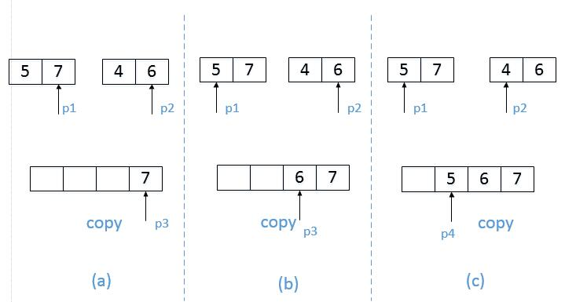

* [1.二维数组中的查找](#1-二维数组中的查找)
* [2.替换空格](#2-替换空格)
* [3.从尾到头打印链表](#3-从尾到头打印链表)
* [4.重建二叉树](#4-重建二叉树)
* [5.用两个栈实现队列](#5-用两个栈实现队列)
* [6.旋转数组的最小数字](#6-旋转数组的最小数字)
* [7.斐波那契数列](#7-斐波那契数列)
* [8.跳台阶](#8-跳台阶)
* [9.变态跳台阶](#9-变态跳台阶)
* [10.矩形覆盖](#10-矩形覆盖)
* [11.二进制中1的个数](#11-二进制中1的个数)
* [12.数值的整数次方](#12-数值的整数次方)
* [13.调整数组顺序使奇数位于偶数前面](#13-调整数组顺序使奇数位于偶数前面)
* [14.链表中倒数第k个结点](#14-链表中倒数第k个结点)
* [15.反转链表](#15-反转链表)
* [16.合并两个排序的链表](#16-合并两个排序的链表)
* [17.树的子结构](#17-树的子结构)
* [18.二叉树的镜像](#18-二叉树的镜像)
* [19.包含min函数的栈](#19-包含min函数的栈)
* [20.栈的压入弹出序列](#20-栈的压入弹出序列)
* [21.从上往下打印二叉树](#21-从上往下打印二叉树)
* [22.二叉搜索树的后序遍历序列](#22-二叉搜索树的后序遍历序列)
* [23.二叉树中和为某一值的路径](#23-二叉树中和为某一值的路径)
* [24.复杂链表的复制](#24-复杂链表的复制)
* [25.二叉搜索树与双向链表](#25-二叉搜索树与双向链表)
* [26.字符串的排列](#26-字符串的排列)
* [27.数组中出现次数超过一半的数字](#27-数组中出现次数超过一半的数字)
* [28.最小的k个数](#28-最小的k个数)
* [29.连续子数组的最大和](#29-连续子数组的最大和)
* [30.整数中1出现的次数](#30-整数中1出现的次数)
* [31.把数组排成最小的数](#31-把数组排成最小的数)
* [32.丑数](#32-丑数)
* [33.第一个只出现一次的字符](#33-第一个只出现一次的字符)
* [34.数组中的逆序对](#34-数组中的逆序对)
* [35.两个链表的第一个公共结点](#35-两个链表的第一个公共结点)
* [36.数字在排序数组中出现的次数](#36-数字在排序数组中出现的次数)
* [37.二叉树的深度](#37-二叉树的深度)
* [38.平衡二叉树](#38-平衡二叉树)
* [39.数组中只出现一次的数字](#39-数组中只出现一次的数字)
* [40.和为s的连续正数序列](#40-和为s的连续正数序列)
* 题号顺序参照牛客网OJ顺序

# 1-二维数组中的查找

[NowCoder](https://www.nowcoder.com/practice/abc3fe2ce8e146608e868a70efebf62e?tpId=13&tqId=11154&tPage=1&rp=1&ru=/ta/coding-interviews&qru=/ta/coding-interviews/question-ranking)

## 题目描述

在一个二维数组中（每个一维数组的长度相同），每一行都按照从左到右递增的顺序排序，每一列都按照从上到下递增的顺序排序。请完成一个函数，输入这样的一个二维数组和一个整数，判断数组中是否含有该整数。
```java
public class Solution {
    public boolean Find(int target, int [][] array) {
		int row=array.length-1;
		int col=0;//从数组左下角出发
		while(row>=0 && col<array[0].length){
			if(array[row][col]<target){
				col++;
			}else if(array[row][col]>target){
				row--;
			}else{
				return true;
			}
		}
		return false;
    }
}
```
# 2-替换空格

[NowCoder](https://www.nowcoder.com/practice/4060ac7e3e404ad1a894ef3e17650423?tpId=13&tqId=11155&tPage=1&rp=1&ru=%2Fta%2Fcoding-interviews&qru=%2Fta%2Fcoding-interviews%2Fquestion-ranking)

## 题目描述

请实现一个函数，将一个字符串中的每个空格替换成“%20”。例如，当字符串为We Are Happy.则经过替换之后的字符串为We%20Are%20Happy。
```java
public class Solution {
    public String replaceSpace(StringBuffer str) {
    	String string=str.toString();
    	char[] c=string.toCharArray();
    	StringBuffer sb=new StringBuffer();
    	for(int i=0;i<c.length;i++){
    		if(c[i]==' '){
    			sb.append("%20");
    		}else{
    			sb.append(c[i]);
    		}
    	}
		return sb.toString();
    }
}
```
# 3-从尾到头打印链表

[NowCoder](https://www.nowcoder.com/practice/d0267f7f55b3412ba93bd35cfa8e8035?tpId=13&tqId=11156&tPage=1&rp=1&ru=%2Fta%2Fcoding-interviews&qru=%2Fta%2Fcoding-interviews%2Fquestion-ranking)

## 题目描述

输入一个链表，按链表值从尾到头的顺序返回一个ArrayList。
```java
public class Solution {
    ArrayList<Integer> arrayList=new ArrayList<Integer>();
    public ArrayList<Integer> printListFromTailToHead(ListNode listNode) {
        if(listNode!=null){
            printListFromTailToHead(listNode.next);
            arrayList.add(listNode.val);
        }
        return arrayList;
    }
}  
```
# 4-重建二叉树

[NowCoder](https://www.nowcoder.com/practice/8a19cbe657394eeaac2f6ea9b0f6fcf6?tpId=13&tqId=11157&tPage=1&rp=1&ru=%2Fta%2Fcoding-interviews&qru=%2Fta%2Fcoding-interviews%2Fquestion-ranking)

## 题目描述

输入某二叉树的前序遍历和中序遍历的结果，请重建出该二叉树。假设输入的前序遍历和中序遍历的结果中都不含重复的数字。例如输入前序遍历序列{1,2,4,7,3,5,6,8}和中序遍历序列{4,7,2,1,5,3,8,6}，则重建二叉树并返回。
```java
public class Solution {
    public TreeNode reConstructBinaryTree(int [] pre,int [] in) {
   		TreeNode root=reConstructBinaryTree(pre,0,pre.length-1,in,0,in.length-1);
        return root;
    }
    private TreeNode reConstructBinaryTree(int[] pre,int startPre,int endPre,int[] in ,int startIn,int endIn){
        if(startPre>endPre||startIn>endIn)return null;//递归结束条件：没有元素
        TreeNode root=new TreeNode(pre[startPre]);
        for(int i=startIn;i<=endIn;i++){
            if(in[i]==root.val){
                //根据root元素把pre和in分成左右两部分，左边是root的左子树，右边是root的右子树，继续递归求解还原整个二叉树
                //in[startin,i-1]左,i根,in[i+1,endin]右
                //startpre根,pre[startpre+1,startpre+i-startin]左,pre[startpre+i-startin+1,endpre]右
                root.left=reConstructBinaryTree(pre,startPre+1,startPre+i-startIn,in ,startIn,i-1);
                root.right=reConstructBinaryTree(pre,startPre+i-startIn+1,endPre,in ,i+1,endIn);
            }
        }
        return root;
    }
   
}
```
# 5-用两个栈实现队列

[NowCoder](https://www.nowcoder.com/practice/54275ddae22f475981afa2244dd448c6?tpId=13&tqId=11158&tPage=1&rp=1&ru=%2Fta%2Fcoding-interviews&qru=%2Fta%2Fcoding-interviews%2Fquestion-ranking)

## 题目描述

用两个栈来实现一个队列，完成队列的Push和Pop操作。 队列中的元素为int类型。
```java
public class Solution {
    Stack<Integer> stack1 = new Stack<Integer>();
    Stack<Integer> stack2 = new Stack<Integer>();
    
    public void push(int node) {
        stack1.push(node);
    }
    
    public int pop() {
        int a;
        if(stack2.isEmpty()){
            while(!stack1.isEmpty()){
                a=stack1.pop();
                stack2.push(a);
                
            }
        }
    	a=stack2.pop();
     
        return a;
    }
}
```
# 6-旋转数组的最小数字

[NowCoder](https://www.nowcoder.com/practice/9f3231a991af4f55b95579b44b7a01ba?tpId=13&tqId=11159&tPage=1&rp=1&ru=%2Fta%2Fcoding-interviews&qru=%2Fta%2Fcoding-interviews%2Fquestion-ranking)

## 题目描述

把一个数组最开始的若干个元素搬到数组的末尾，我们称之为数组的旋转。 输入一个非减排序的数组的一个旋转，输出旋转数组的最小元素。 例如数组{3,4,5,1,2}为{1,2,3,4,5}的一个旋转，该数组的最小值为1。 NOTE：给出的所有元素都大于0，若数组大小为0，请返回0。
```java
public class Solution {
    public int minNumberInRotateArray(int [] array) {
    	if(array.length==0)return 0;
        int bottom=0;
        int top=array.length-1;
        
        while(bottom<top){
        int mid=bottom+(top-bottom)/2;
        	if(array[mid]>array[top]){
            	bottom=mid+1;
        	}else if(array[mid]==array[top]){
            	top--;
       		}else{
            	top=mid;
        	}
        }
        return array[bottom];
    }
}
```
# 7-斐波那契数列

[NowCoder](https://www.nowcoder.com/practice/c6c7742f5ba7442aada113136ddea0c3?tpId=13&tqId=11160&tPage=1&rp=1&ru=%2Fta%2Fcoding-interviews&qru=%2Fta%2Fcoding-interviews%2Fquestion-ranking)

## 题目描述

大家都知道斐波那契数列，现在要求输入一个整数n，请你输出斐波那契数列的第n项（从0开始，第0项为0）。n<=39
```java
public class Solution {
    public int Fibonacci(int n) {
		if(n<0||n>39)return -1;
        if(n<=1)return n;
        int[] arr=new int[n+1];
        arr[0]=0;
        arr[1]=1;
        for(int i=2;i<n+1;i++){
            arr[i]=arr[i-1]+arr[i-2];
        }
        return arr[n];
    }
}
```
# 8-跳台阶

[NowCoder](https://www.nowcoder.com/practice/8c82a5b80378478f9484d87d1c5f12a4?tpId=13&tqId=11161&tPage=1&rp=1&ru=%2Fta%2Fcoding-interviews&qru=%2Fta%2Fcoding-interviews%2Fquestion-ranking)

## 题目描述
一只青蛙一次可以跳上1级台阶，也可以跳上2级。求该青蛙跳上一个n级的台阶总共有多少种跳法（先后次序不同算不同的结果）。
```java
public class Solution {
    public int JumpFloor(int target) {
		if(target==1)return 1;
        else if(target==2)return 2;
        else if(target<0)return 0;
        else return JumpFloor(target-1)+JumpFloor(target-2);
    }
}
```
# 9-变态跳台阶

[NowCoder](https://www.nowcoder.com/practice/22243d016f6b47f2a6928b4313c85387?tpId=13&tqId=11162&tPage=1&rp=1&ru=%2Fta%2Fcoding-interviews&qru=%2Fta%2Fcoding-interviews%2Fquestion-ranking)

## 题目描述
一只青蛙一次可以跳上1级台阶，也可以跳上2级……它也可以跳上n级。求该青蛙跳上一个n级的台阶总共有多少种跳法。
```java
public class Solution {
    public int JumpFloorII(int target) {
        if(target==1)return 1;
		if(target==2)return 2;
		int[] arr=new int[target];
        arr[0]=1;
        arr[1]=2;
		for(int i=2;i<arr.length;i++){
			arr[i]=2*arr[i-1];
		}
		return arr[target-1];
    }
}
```
# 10-矩形覆盖

[NowCoder](https://www.nowcoder.com/practice/72a5a919508a4251859fb2cfb987a0e6?tpId=13&tqId=11163&tPage=1&rp=1&ru=%2Fta%2Fcoding-interviews&qru=%2Fta%2Fcoding-interviews%2Fquestion-ranking)

## 题目描述
我们可以用2x1的小矩形横着或者竖着去覆盖更大的矩形。请问用n个2x1的小矩形无重叠地覆盖一个2xn的大矩形，总共有多少种方法？
```java
public class Solution {
    public int RectCover(int target) {
        if(target==0)return 0;
		if(target==1)return 1;
		if(target==2)return 2;
		int[] arr=new int[target];
        arr[0]=1;
        arr[1]=2;
		for(int i=2;i<arr.length;i++){
			arr[i]=arr[i-1]+arr[i-2];
		}
		return arr[target-1];
    }
}
```
# 11-二进制中1的个数

[NowCoder](https://www.nowcoder.com/practice/8ee967e43c2c4ec193b040ea7fbb10b8?tpId=13&tqId=11164&tPage=1&rp=1&ru=%2Fta%2Fcoding-interviews&qru=%2Fta%2Fcoding-interviews%2Fquestion-ranking)

## 题目描述
输入一个整数，输出该数二进制表示中1的个数。其中负数用补码表示。
```java
public class Solution {
    public int NumberOf1(int n) {
		int count=0;
        while(n!=0){
            count++;
            n=n&(n-1);
        }
        return count;
    }
}
```
# 12-数值的整数次方

[NowCoder](https://www.nowcoder.com/practice/1a834e5e3e1a4b7ba251417554e07c00?tpId=13&tqId=11165&tPage=1&rp=1&ru=%2Fta%2Fcoding-interviews&qru=%2Fta%2Fcoding-interviews%2Fquestion-ranking)

## 题目描述
给定一个double类型的浮点数base和int类型的整数exponent。求base的exponent次方。
```java
public class Solution {
    public double Power(double base, int exponent) {
        Double res=1.0;
        if(exponent>=0){
        for(int i=0;i<exponent;i++){
            res=res*base;
        }
        return res;
        }else{
            for(int i=0;i<-exponent;i++){
            res=res*base;
        }
        	return 1.0/res;
        }
  }
}
```
# 13-调整数组顺序使奇数位于偶数前面

[NowCoder](https://www.nowcoder.com/practice/beb5aa231adc45b2a5dcc5b62c93f593?tpId=13&tqId=11166&tPage=1&rp=1&ru=%2Fta%2Fcoding-interviews&qru=%2Fta%2Fcoding-interviews%2Fquestion-ranking)

## 题目描述
输入一个整数数组，实现一个函数来调整该数组中数字的顺序，使得所有的奇数位于数组的前半部分，所有的偶数位于数组的后半部分，并保证奇数和奇数，偶数和偶数之间的相对位置不变。
```java
import java.util.ArrayList;
public class Solution {
   public void reOrderArray(int [] array) {
      int odd=0;
       for(int val:array){
           if(val%2==1)odd++;
       }
       int[] res=array.clone();
       int i=0,j=odd;
       for(int val:res){
           if(val%2==1){
               array[i++]=val;
           }else{
               array[j++]=val;
           }
       }
    }
}
```
# 14-链表中倒数第k个结点

[NowCoder](https://www.nowcoder.com/practice/529d3ae5a407492994ad2a246518148a?tpId=13&tqId=11167&tPage=1&rp=1&ru=%2Fta%2Fcoding-interviews&qru=%2Fta%2Fcoding-interviews%2Fquestion-ranking)

## 题目描述
输入一个链表，输出该链表中倒数第k个结点。
```java
public class Solution {
    public ListNode FindKthToTail(ListNode head,int k) {
		ListNode p1=head;
        ListNode p2=head;
        if(head==null||k<=0) return null;
        for(int i=1;i<k;i++){
            if(p1.next!=null){
                p1=p1.next;
            }
            else {
                return null;}
        }
        while(p1.next!=null){
            p1=p1.next;
            p2=p2.next;
        }
        return p2;
    }
}
```
# 15-反转链表

[NowCoder](https://www.nowcoder.com/practice/75e878df47f24fdc9dc3e400ec6058ca?tpId=13&tqId=11168&tPage=1&rp=1&ru=%2Fta%2Fcoding-interviews&qru=%2Fta%2Fcoding-interviews%2Fquestion-ranking)

## 题目描述
输入一个链表，反转链表后，输出新链表的表头。
```java
public class Solution {
    public ListNode ReverseList(ListNode head) {
		if(head==null||head.next==null) return head;
        ListNode rehead=ReverseList(head.next);
        head.next.next=head;
        head.next=null;
        return rehead;
    }
}
```
# 16-合并两个排序的链表

[NowCoder](https://www.nowcoder.com/practice/d8b6b4358f774294a89de2a6ac4d9337?tpId=13&tqId=11169&tPage=1&rp=1&ru=%2Fta%2Fcoding-interviews&qru=%2Fta%2Fcoding-interviews%2Fquestion-ranking)

## 题目描述
输入两个单调递增的链表，输出两个链表合成后的链表，当然我们需要合成后的链表满足单调不减规则。
```java
public class Solution {
    public ListNode Merge(ListNode list1,ListNode list2) {
        if(list1==null) return list2;
        if(list2==null) return list1;
        if(list1.val<list2.val){
            list1.next=Merge(list1.next,list2);
            return list1;
        }else{
            list2.next=Merge(list1,list2.next);
            return list2;
        }
    }
}
```
# 17-树的子结构

[NowCoder](https://www.nowcoder.com/practice/6e196c44c7004d15b1610b9afca8bd88?tpId=13&tqId=11170&tPage=1&rp=1&ru=%2Fta%2Fcoding-interviews&qru=%2Fta%2Fcoding-interviews%2Fquestion-ranking)

## 题目描述
输入两棵二叉树A，B，判断B是不是A的子结构。（ps：我们约定空树不是任意一个树的子结构）
```java
public class Solution {
    public boolean HasSubtree(TreeNode root1,TreeNode root2){
		 boolean flag=false;
		//当Tree1和Tree2都不为零的时候，才进行比较。否则直接返回false
		 if(root1!=null && root2!=null){
			//如果找到了对应Tree2的根节点的点
			 if(root1.val==root2.val){
				//以这个根节点为为起点判断是否包含Tree2
				flag=check(root1,root2); 
			 }
			//如果找不到，那么就再去root的左儿子当作起点
			 if(!flag)flag=HasSubtree(root1.left, root2);
			//如果还找不到，那么就再去root的右儿子当作起点
			 if(!flag)flag=HasSubtree(root1.right, root2);
		 }
		 return flag;
	 }
	 public boolean check(TreeNode node1,TreeNode node2){
		 //如果Tree2已经遍历完了都能对应的上，返回true
		 if(node2==null)return true;
		 //如果Tree2还没有遍历完，Tree1却遍历完了。返回false
		 if(node1==null)return false;
		 //如果其中有一个点没有对应上，返回false
		 if(node1.val!=node2.val)return false;
		 //如果根节点对应的上，那么就分别去子节点里面匹配
		 return check(node1.left,node2.left)&&check(node1.right,node2.right);
	 }
}
```
# 18-二叉树的镜像

[NowCoder](https://www.nowcoder.com/practice/564f4c26aa584921bc75623e48ca3011?tpId=13&tqId=11171&tPage=1&rp=1&ru=%2Fta%2Fcoding-interviews&qru=%2Fta%2Fcoding-interviews%2Fquestion-ranking)

## 题目描述
操作给定的二叉树，将其变换为源二叉树的镜像。

输入描述:二叉树的镜像定义：源二叉树 

    	    8
    	   /  \
    	  6   10
    	 / \  / \
    	5  7 9 11
    	镜像二叉树
    	    8
    	   /  \
    	  10   6
    	 / \  / \
    	11 9 7  5
```java
public class Solution {
    public void Mirror(TreeNode root) {
        if(root==null)return;
		if(root.left==null && root.right==null)return;
		TreeNode temp;
		temp=root.left;
		root.left=root.right;
		root.right=temp;
		if(root.left!=null)Mirror(root.left);
		if(root.right!=null)Mirror(root.right);
    }
}
```
# 18-顺时针打印矩阵

[NowCoder](https://www.nowcoder.com/practice/9b4c81a02cd34f76be2659fa0d54342a?tpId=13&tqId=11172&tPage=1&rp=1&ru=%2Fta%2Fcoding-interviews&qru=%2Fta%2Fcoding-interviews%2Fquestion-ranking)

## 题目描述
输入一个矩阵，按照从外向里以顺时针的顺序依次打印出每一个数字，例如，如果输入如下4 X 4矩阵： 1 2 3 4 5 6 7 8 9 10 11 12 13 14 15 16 则依次打印出数字1,2,3,4,8,12,16,15,14,13,9,5,6,7,11,10.
```java
public class Solution {
    public ArrayList<Integer> printMatrix(int [][] matrix){
		int rows=matrix.length;
		int cols=matrix[0].length;
		if(rows==0 || cols==0)return null;
		ArrayList<Integer> res=new ArrayList<Integer>();
		int start=0;
		while(rows>2*start&& cols>2*start){
			int endX=cols-start-1;
			int endY=rows-start-1;
			 //从左到右打印一行
			for(int i=start;i<=endX;i++){
				res.add(matrix[start][i]);
			}
			//从上到下打印一行
			if(start<endY){
				for(int i=start+1;i<=endY;i++){
					res.add(matrix[i][endX]);
				}
			}
			//从右到左打印一行
			if (start < endX && start < endY) {
				for (int i=endX-1; i>=start; i--) {
					res.add(matrix[endY][i]);
				}
			}
		    //从下到上打印一行
			if (start<endX && start<endY-1) {
				for (int i=endY-1; i>=start+1; i--) {
				     res.add(matrix[i][start]);
				}
			}
			start++;
		}
		return res;
	}
}
```
# 19-包含min函数的栈

[NowCoder](https://www.nowcoder.com/practice/4c776177d2c04c2494f2555c9fcc1e49?tpId=13&tqId=11173&tPage=1&rp=1&ru=%2Fta%2Fcoding-interviews&qru=%2Fta%2Fcoding-interviews%2Fquestion-ranking)

## 题目描述
定义栈的数据结构，请在该类型中实现一个能够得到栈中所含最小元素的min函数（时间复杂度应为O（1））。
```java
import java.util.Stack;

public class Solution {
	private static Stack<Integer> stack=new Stack<>();
	private static Stack<Integer> minStack=new Stack<>();
	
	public static void push(Integer i){
		stack.push(i);
		if(minStack.size()==0 || i<minStack.peek()){
			minStack.push(i);
		}else{
			minStack.push(minStack.peek());
		}
	}
	
	public static void pop(){
		if(stack.size()>0 && minStack.size()>0){
			stack.pop();
			minStack.pop();
		}else{
			return;
		}
	}
	
	public static Integer min(){
		if(stack.size()>0 && minStack.size()>0){
			return minStack.peek();
		}else{
			return null;
		}
	}
}
```

# 20-栈的压入弹出序列

[NowCoder](https://www.nowcoder.com/practice/d77d11405cc7470d82554cb392585106?tpId=13&tqId=11174&tPage=2&rp=1&ru=%2Fta%2Fcoding-interviews&qru=%2Fta%2Fcoding-interviews%2Fquestion-ranking)

## 题目描述
输入两个整数序列，第一个序列表示栈的压入顺序，请判断第二个序列是否可能为该栈的弹出顺序。假设压入栈的所有数字均不相等。例如序列1,2,3,4,5是某栈的压入顺序，序列4,5,3,2,1是该压栈序列对应的一个弹出序列，但4,3,5,1,2就不可能是该压栈序列的弹出序列。（注意：这两个序列的长度是相等的）
```java
public class Solution {
	public boolean IsPopOrder(int [] pushA,int [] popA){
		if(pushA.length==0 || popA.length==0 ||pushA.length!=popA.length)return false;
		Stack<Integer> stack=new Stack<Integer>();
		int index=0;
		for(int i=0;i<pushA.length;i++){
			stack.push(pushA[i]);
			while(!stack.isEmpty()&&stack.peek()==popA[index]){
				stack.pop();
				index++;
			}
		}
		return stack.isEmpty();
	}
}
```
# 21-从上往下打印二叉树

[NowCoder](https://www.nowcoder.com/practice/7fe2212963db4790b57431d9ed259701?tpId=13&tqId=11175&tPage=2&rp=1&ru=%2Fta%2Fcoding-interviews&qru=%2Fta%2Fcoding-interviews%2Fquestion-ranking)

## 题目描述
从上往下打印出二叉树的每个节点，同层节点从左至右打印。
```java
public class Solution {
    public ArrayList<Integer> PrintFromTopToBottom(TreeNode root){
		ArrayList<Integer> list=new ArrayList<Integer>();
        if(root==null)return list;
		Queue<TreeNode> queue=new LinkedList<TreeNode>();
		queue.offer(root);
		while(!queue.isEmpty()){
			TreeNode node=queue.poll();
			if(node.left!=null)queue.offer(node.left);
			if(node.right!=null)queue.offer(node.right);
			list.add(node.val);
		}
		return list;
	}
}
```
# 22-二叉搜索树的后序遍历序列

[NowCoder](https://www.nowcoder.com/practice/a861533d45854474ac791d90e447bafd?tpId=13&tqId=11176&tPage=2&rp=1&ru=%2Fta%2Fcoding-interviews&qru=%2Fta%2Fcoding-interviews%2Fquestion-ranking)

## 题目描述
输入一个整数数组，判断该数组是不是某二叉搜索树的后序遍历的结果。如果是则输出Yes,否则输出No。假设输入的数组的任意两个数字都互不相同。
```java
public class Solution {
	public static boolean VerifySquenceOfBST(int [] sequence){
		if(sequence.length==0)return false;
		int length=sequence.length;
		int root=sequence[length-1];
		int i=0;
		for(;i<length-1;i++){
			if(sequence[i]>root){
				break;
			}
		}
		int j=i;
		for(;j<length-1;j++){
			if(sequence[j]<root)return false;
		}
		boolean left=true;
		if(i>0){
			int[] leftTree=Arrays.copyOfRange(sequence, 0,i);//前闭后开
			left=VerifySquenceOfBST(leftTree);
		}
		boolean right=true;
		if(i<length-1){
			int[] rightTree=Arrays.copyOfRange(sequence,i,length-1);
			right=VerifySquenceOfBST(rightTree);
		}
		return left&&right;
	}
}
```
# 23-二叉树中和为某一值的路径

[NowCoder](https://www.nowcoder.com/practice/b736e784e3e34731af99065031301bca?tpId=13&tqId=11177&tPage=2&rp=1&ru=%2Fta%2Fcoding-interviews&qru=%2Fta%2Fcoding-interviews%2Fquestion-ranking)

## 题目描述
输入一颗二叉树的跟节点和一个整数，打印出二叉树中结点值的和为输入整数的所有路径。路径定义为从树的根结点开始往下一直到叶结点所经过的结点形成一条路径。(注意: 在返回值的list中，数组长度大的数组靠前)
```java
public class Solution {
    public ArrayList<ArrayList<Integer>> FindPath(TreeNode root,int target){
		ArrayList<ArrayList<Integer>> paths=new ArrayList<ArrayList<Integer>>();
		ArrayList<Integer> path=new ArrayList<Integer>();
		if(root==null)return paths;
		FindPath(paths,path,root,target);
		return paths;
	}
	public void FindPath(ArrayList<ArrayList<Integer>> paths,ArrayList<Integer> path,TreeNode root,int target){
		path.add(root.val);
		if(root.left==null && root.right==null&&target==root.val){
			paths.add(path);
			return;
		}
		ArrayList<Integer> path2=new ArrayList<Integer>();
		path2.addAll(path);
		if(root.left!=null)FindPath(paths, path, root.left, target-root.val);
		if(root.right!=null)FindPath(paths, path2, root.right, target-root.val);
		
	}
}
```
# 24-复杂链表的复制

[NowCoder](https://www.nowcoder.com/practice/f836b2c43afc4b35ad6adc41ec941dba?tpId=13&tqId=11178&tPage=2&rp=1&ru=%2Fta%2Fcoding-interviews&qru=%2Fta%2Fcoding-interviews%2Fquestion-ranking)

## 题目描述
输入一个复杂链表（每个节点中有节点值，以及两个指针，一个指向下一个节点，另一个特殊指针指向任意一个节点），返回结果为复制后复杂链表的head。（注意，输出结果中请不要返回参数中的节点引用，否则判题程序会直接返回空）
<div align="center">  </div><br>

```java
/*
*解题思路：
*1、遍历链表，复制每个结点，如复制结点A得到A1，将结点A1插到结点A后面；
*2、重新遍历链表，复制老结点的随机指针给新结点，如A1.random = A.random.next;
*3、拆分链表，将链表拆分为原链表和复制后的链表
*/
public class Solution {
    public RandomListNode Clone(RandomListNode pHead) {
        if(pHead == null) {
            return null;
        }
        RandomListNode currentNode = pHead;
        //1、复制每个结点，如复制结点A得到A1，将结点A1插到结点A后面；
        while(currentNode != null){
            RandomListNode cloneNode = new RandomListNode(currentNode.label);
            RandomListNode nextNode = currentNode.next;
            currentNode.next = cloneNode;
            cloneNode.next = nextNode;
            currentNode = nextNode;
        }
         
        currentNode = pHead;
        //2、重新遍历链表，复制老结点的随机指针给新结点，如A1.random = A.random.next;
        while(currentNode != null) {
            currentNode.next.random = currentNode.random==null?null:currentNode.random.next;
            currentNode = currentNode.next.next;
        }
         
        //3、拆分链表，将链表拆分为原链表和复制后的链表
        currentNode = pHead;
        RandomListNode pCloneHead = pHead.next;
        while(currentNode != null) {
            RandomListNode cloneNode = currentNode.next;
            currentNode.next = cloneNode.next;
            cloneNode.next = cloneNode.next==null?null:cloneNode.next.next;
            currentNode = currentNode.next;
        }
         
        return pCloneHead;
    }
}
```
# 25-二叉搜索树与双向链表

[NowCoder](https://www.nowcoder.com/practice/947f6eb80d944a84850b0538bf0ec3a5?tpId=13&tqId=11179&tPage=2&rp=1&ru=%2Fta%2Fcoding-interviews&qru=%2Fta%2Fcoding-interviews%2Fquestion-ranking)

## 题目描述
输入一棵二叉搜索树，将该二叉搜索树转换成一个排序的双向链表。要求不能创建任何新的结点，只能调整树中结点指针的指向。
```java
public class Solution {
 public TreeNode Convert(TreeNode root) {
        if(root==null)
            return null;
        if(root.left==null&&root.right==null)
            return root;
        // 1.将左子树构造成双链表，并返回链表头节点
        TreeNode left = Convert(root.left);
        TreeNode p = left;
        // 2.定位至左子树双链表最后一个节点
        while(p!=null&&p.right!=null){
            p = p.right;
        }
        // 3.如果左子树链表不为空的话，将当前root追加到左子树链表
        if(left!=null){
            p.right = root;
            root.left = p;
        }
        // 4.将右子树构造成双链表，并返回链表头节点
        TreeNode right = Convert(root.right);
        // 5.如果右子树链表不为空的话，将该链表追加到root节点之后
        if(right!=null){
            right.left = root;
            root.right = right;
        }
        return left!=null?left:root;       
    }
}
```
# 26-字符串的排列

[NowCoder](https://www.nowcoder.com/practice/fe6b651b66ae47d7acce78ffdd9a96c7?tpId=13&tqId=11180&tPage=2&rp=1&ru=%2Fta%2Fcoding-interviews&qru=%2Fta%2Fcoding-interviews%2Fquestion-ranking)

## 题目描述
输入一个字符串,按字典序打印出该字符串中字符的所有排列。例如输入字符串abc,则打印出由字符a,b,c所能排列出来的所有字符串abc,acb,bac,bca,cab和cba。
```java
public class Solution {
	 public ArrayList<String> Permutation(String str){  
        if (str == null)  
            return null;  
        ArrayList<String> list = new ArrayList<String>();  
        char[] pStr = str.toCharArray();  
  
        Permutation(pStr, 0, list);  
        Collections.sort(list);  
        return list;  
    }  
  
    static void Permutation(char[] str, int i, ArrayList<String> list){  
        // 如果为空  
        if (str == null)  
            return;  
        // 如果i指向了最后一个字符  
        if (i == str.length - 1)  {  
            if (list.contains(String.valueOf(str)))  
                return;  
            list.add(String.valueOf(str));  
        } else  {// i指向当前我们做排列操作的字符串的第一个字符  
            for (int j = i; j < str.length; j++)  
            {  // 把做排列操作的字符串的第一个字符和后面的所有字符交换  
                char temp = str[j];  
                str[j] = str[i];  
                str[i] = temp;  
                // 交换后对i后面的字符串递归做排列操作  
                Permutation(str, i + 1, list);  
                // 每一轮结束后换回来进行下一轮排列操作  
                temp = str[j];  
                str[j] = str[i];  
                str[i] = temp;  
            }  
        }  
  
}
}
```
# 27-数组中出现次数超过一半的数字

[NowCoder](https://www.nowcoder.com/practice/e8a1b01a2df14cb2b228b30ee6a92163?tpId=13&tqId=11181&tPage=2&rp=1&ru=%2Fta%2Fcoding-interviews&qru=%2Fta%2Fcoding-interviews%2Fquestion-ranking)

## 题目描述
数组中有一个数字出现的次数超过数组长度的一半，请找出这个数字。例如输入一个长度为9的数组{1,2,3,2,2,2,5,4,2}。由于数字2在数组中出现了5次，超过数组长度的一半，因此输出2。如果不存在则输出0。
```java
public class Solution {
   public int MoreThanHalfNum_Solution(int [] arr) {
        if(arr==null) return 0;
        int count=1;
        int res=arr[0];
        for(int i=1;i<arr.length;i++){
            if(count==0){
                count++;
                res=arr[i];
            }
            if(arr[i]==res)
                count++;
            else
                count--;
        }
        //verify
        count=0;
        for(int i=0;i<arr.length;i++){
            if(arr[i]==res)
                count++;
        }
        return (count>arr.length/2)?res:0;
    }
}
```
# 28-最小的k个数

[NowCoder](https://www.nowcoder.com/practice/6a296eb82cf844ca8539b57c23e6e9bf?tpId=13&tqId=11182&tPage=2&rp=1&ru=%2Fta%2Fcoding-interviews&qru=%2Fta%2Fcoding-interviews%2Fquestion-ranking)

## 题目描述
输入n个整数，找出其中最小的K个数。例如输入4,5,1,6,2,7,3,8这8个数字，则最小的4个数字是1,2,3,4,。
```java
public class Solution {
	public ArrayList<Integer> GetLeastNumbers_Solution(int[] nums, int k) {
    if (k > nums.length || k <= 0)
        return new ArrayList<>();
    PriorityQueue<Integer> maxHeap = new PriorityQueue<>((o1, o2) -> o2 - o1);
    for (int num : nums) {
        maxHeap.add(num);
        if (maxHeap.size() > k)
            maxHeap.poll();
    }
    ArrayList<Integer> ret = new ArrayList<>(maxHeap);
    return ret;
}
}
```
# 29-连续子数组的最大和

[NowCoder](https://www.nowcoder.com/practice/459bd355da1549fa8a49e350bf3df484?tpId=13&tqId=11183&tPage=2&rp=1&ru=%2Fta%2Fcoding-interviews&qru=%2Fta%2Fcoding-interviews%2Fquestion-ranking)

## 题目描述
HZ偶尔会拿些专业问题来忽悠那些非计算机专业的同学。今天测试组开完会后,他又发话了:在古老的一维模式识别中,常常需要计算连续子向量的最大和,当向量全为正数的时候,问题很好解决。但是,如果向量中包含负数,是否应该包含某个负数,并期望旁边的正数会弥补它呢？例如:{6,-3,-2,7,-15,1,2,2},连续子向量的最大和为8(从第0个开始,到第3个为止)。给一个数组，返回它的最大连续子序列的和，你会不会被他忽悠住？(子向量的长度至少是1)
```java
public class Solution {
    public int FindGreatestSumOfSubArray(int[] array) {
        int sum=0;
        int max=Integer.MIN_VALUE;
        for(int i=0;i<array.length;i++){
        	if(sum<0){
        		sum=array[i];
        	}else{
        		sum+=array[i];
        	}
        	if(sum>max){
        		max=sum;
        	}
        }
        return max;
    }
}
```
# 30-整数中1出现的次数

[NowCoder](https://www.nowcoder.com/practice/bd7f978302044eee894445e244c7eee6?tpId=13&tqId=11184&tPage=2&rp=1&ru=%2Fta%2Fcoding-interviews&qru=%2Fta%2Fcoding-interviews%2Fquestion-ranking)

## 题目描述
求出1-13的整数中1出现的次数,并算出100-1300的整数中1出现的次数？为此他特别数了一下1~13中包含1的数字有1、10、11、12、13因此共出现6次,但是对于后面问题他就没辙了。ACMer希望你们帮帮他,并把问题更加普遍化,可以很快的求出任意非负整数区间中1出现的次数（从1 到 n 中1出现的次数）。
```java

/*
设N = abcde ,其中abcde分别为十进制中各位上的数字。
如果要计算百位上1出现的次数，它要受到3方面的影响：百位上的数字，百位以下（低位）的数字，百位以上（高位）的数字。
① 如果百位上数字为0，百位上可能出现1的次数由更高位决定。比如：12013，则可以知道百位出现1的情况可能是：100~199，1100~1199,2100~2199，，...，11100~11199，一共1200个。可以看出是由更高位数字（12）决定，并且等于更高位数字（12）乘以 当前位数（100）。
② 如果百位上数字为1，百位上可能出现1的次数不仅受更高位影响还受低位影响。比如：12113，则可以知道百位受高位影响出现的情况是：100~199，1100~1199,2100~2199，，....，11100~11199，一共1200个。和上面情况一样，并且等于更高位数字（12）乘以 当前位数（100）。但同时它还受低位影响，百位出现1的情况是：12100~12113,一共114个，等于低位数字（113）+1。
③ 如果百位上数字大于1（2~9），则百位上出现1的情况仅由更高位决定，比如12213，则百位出现1的情况是：100~199,1100~1199，2100~2199，...，11100~11199,12100~12199,一共有1300个，并且等于更高位数字+1（12+1）乘以当前位数（100）。
*/ 
public class Solution {
    public int NumberOf1Between1AndN_Solution(int n) {
        int count = 0;//1的个数
        int i = 1;//当前位
        int current = 0,after = 0,before = 0;
        while((n/i)!= 0){           
            current = (n/i)%10;  //当前位数字
            before = n/(i*10); //高位数字
            after = n-(n/i)*i; //低位数字
            //如果为0,出现1的次数由高位决定,等于高位数字 * 当前位数
            if (current == 0)
                count += before*i;
            //如果为1,出现1的次数由高位和低位决定,高位*当前位+低位+1
            else if(current == 1)
                count += before * i + after + 1;
            //如果大于1,出现1的次数由高位决定,//（高位数字+1）* 当前位数
            else{
                count += (before + 1) * i;
            }    
            //前移一位
            i = i*10;
        }
        return count;
    }
}
```
# 31-把数组排成最小的数

[NowCoder](https://www.nowcoder.com/practice/8fecd3f8ba334add803bf2a06af1b993?tpId=13&tqId=11185&tPage=2&rp=1&ru=%2Fta%2Fcoding-interviews&qru=%2Fta%2Fcoding-interviews%2Fquestion-ranking)

## 题目描述
输入一个正整数数组，把数组里所有数字拼接起来排成一个数，打印能拼接出的所有数字中最小的一个。例如输入数组{3，32，321}，则打印出这三个数字能排成的最小数字为321323。
```java
public class Solution {
    public String PrintMinNumber(int [] numbers) {
        ArrayList<Integer> list=new ArrayList<>();
        for(int i=0;i<numbers.length;i++){
            list.add(numbers[i]);
        }
        Collections.sort(list,(o1, o2) -> (o1+""+o2).compareTo(o2+""+o1));
        String str="";
        for(Integer i:list){
            str+=i;
        }
        return str;
    }
}
```
# 32-丑数

[NowCoder](https://www.nowcoder.com/practice/6aa9e04fc3794f68acf8778237ba065b?tpId=13&tqId=11186&tPage=2&rp=1&ru=%2Fta%2Fcoding-interviews&qru=%2Fta%2Fcoding-interviews%2Fquestion-ranking)

## 题目描述
把只包含质因子2、3和5的数称作丑数（Ugly Number）。例如6、8都是丑数，但14不是，因为它包含质因子7。 习惯上我们把1当做是第一个丑数。求按从小到大的顺序的第N个丑数。
```java
import java.util.ArrayList;
public class Solution {
    public int GetUglyNumber_Solution(int n) {
        if(n<=0)return 0;
        ArrayList<Integer> list=new ArrayList<Integer>();
        list.add(1);
        int i2=0,i3=0,i5=0;
        while(list.size()<n)//循环的条件
        {
            int m2=list.get(i2)*2;
            int m3=list.get(i3)*3;
            int m5=list.get(i5)*5;
            int min=Math.min(m2,Math.min(m3,m5));
            list.add(min);
            if(min==m2)i2++;
            if(min==m3)i3++;
            if(min==m5)i5++;
        }
        return list.get(list.size()-1);
    }
}
```
# 33-第一个只出现一次的字符

[NowCoder](https://www.nowcoder.com/practice/1c82e8cf713b4bbeb2a5b31cf5b0417c?tpId=13&tqId=11187&tPage=2&rp=1&ru=%2Fta%2Fcoding-interviews&qru=%2Fta%2Fcoding-interviews%2Fquestion-ranking)

## 题目描述
在一个字符串(0<=字符串长度<=10000，全部由字母组成)中找到第一个只出现一次的字符,并返回它的位置, 如果没有则返回 -1（需要区分大小写）
```java
public class Solution {
    public int FirstNotRepeatingChar(String str) {
        char[] chars = str.toCharArray();
        int[] map = new int[256];
        for (int i = 0; i < chars.length; i++) {
            map[chars[i]]++;
        }
        for (int i = 0; i < chars.length; i++) {
            if (map[chars[i]] == 1) return i;
        }
        return -1;
    }
}
```
# 34-数组中的逆序对

[NowCoder](https://www.nowcoder.com/practice/96bd6684e04a44eb80e6a68efc0ec6c5?tpId=13&tqId=11188&tPage=2&rp=1&ru=%2Fta%2Fcoding-interviews&qru=%2Fta%2Fcoding-interviews%2Fquestion-ranking)

## 题目描述
在数组中的两个数字，如果前面一个数字大于后面的数字，则这两个数字组成一个逆序对。输入一个数组,求出这个数组中的逆序对的总数P。并将P对1000000007取模的结果输出。 即输出P%1000000007

输入描述:题目保证输入的数组中没有的相同的数字

数据范围：

对于%50的数据,size<=10^4

对于%75的数据,size<=10^5

对于%100的数据,size<=2*10^5

示例1:输入

1,2,3,4,5,6,7,0

输出

7

## 解题思路
看到这个题目，我们的第一反应是顺序扫描整个数组。每扫描到一个数组的时候，逐个比较该数字和它后面的数字的大小。如果后面的数字比它小，则这两个数字就组成了一个逆序对。假设数组中含有n个数字。由于每个数字都要和O(n)这个数字比较，因此这个算法的时间复杂度为O(n^2)。
我们以数组{7,5,6,4}为例来分析统计逆序对的过程。每次扫描到一个数字的时候，我们不拿ta和后面的每一个数字作比较，否则时间复杂度就是O(n^2)，因此我们可以考虑先比较两个相邻的数字。
<div align="center">  </div><br>

(a) 把长度为4的数组分解成两个长度为2的子数组；

(b) 把长度为2的数组分解成两个成都为1的子数组；

(c) 把长度为1的子数组 合并、排序并统计逆序对 ；

(d) 把长度为2的子数组合并、排序，并统计逆序对；

在上图（a）和（b）中，我们先把数组分解成两个长度为2的子数组，再把这两个子数组分别拆成两个长度为1的子数组。接下来一边合并相邻的子数组，一边统计逆序对的数目。在第一对长度为1的子数组{7}、{5}中7大于5，因此（7,5）组成一个逆序对。同样在第二对长度为1的子数组{6}、{4}中也有逆序对（6,4）。由于我们已经统计了这两对子数组内部的逆序对，因此需要把这两对子数组 排序 如上图（c）所示， 以免在以后的统计过程中再重复统计。

接下来我们统计两个长度为2的子数组子数组之间的逆序对。合并子数组并统计逆序对的过程如下图如下图所示。

我们先用两个指针分别指向两个子数组的末尾，并每次比较两个指针指向的数字。如果第一个子数组中的数字大于第二个数组中的数字，则构成逆序对，并且逆序对的数目等于第二个子数组中剩余数字的个数，如下图（a）和（c）所示。如果第一个数组的数字小于或等于第二个数组中的数字，则不构成逆序对，如图b所示。每一次比较的时候，我们都把较大的数字从后面往前复制到一个辅助数组中，确保 辅助数组（记为copy） 中的数字是递增排序的。在把较大的数字复制到辅助数组之后，把对应的指针向前移动一位，接下来进行下一轮比较。
<div align="center">  </div><br>
过程：先把数组分割成子数组，先统计出子数组内部的逆序对的数目，然后再统计出两个相邻子数组之间的逆序对的数目。在统计逆序对的过程中，还需要对数组进行排序。如果对排序算法很熟悉，我们不难发现这个过程实际上就是归并排序

```java
/*归并排序的改进，把数据分成前后两个数组(递归分到每个数组仅有一个数据项)，
合并数组，合并时，出现前面的数组值array[i]大于后面数组值array[j]时；则
数组array[mid+1]~array[j]都是小于array[i]的，count += j-mid
*/
public class Solution {
    public int InversePairs(int [] arr) {
        if(arr==null)
            return 0;
        int[] copy=arr.clone();//辅助数组
        return InversePairs(arr,copy,0,arr.length-1);
    }
    public int InversePairs(int[] arr,int[] copy,int start,int end){
        if(start==end)
            return 0;
        int mid=start+(end-start)/2;
        int leftCount=InversePairs(arr,copy,start,mid);
        int rightCount=InversePairs(arr,copy,mid+1,end);
        int count=0;
        int i=mid;
        int j=end;
        int copyIndex=end;
        while(i>=start && j>=mid+1){
            if(arr[i]>arr[j]){
                count+=j-mid;
                copy[copyIndex--]=arr[i--];
                if(count>=1000000007)//数值过大求余
                    count%=1000000007;
            }else {
                copy[copyIndex--]=arr[j--];
            }
        }
        while(i>=start){
            copy[copyIndex--]=arr[i--];
        }
        while(j>=mid+1){
            copy[copyIndex--]=arr[j--];
        }
        for(int k=start;k<=end;k++){
            arr[k]=copy[k];
        }
        return (count+leftCount+rightCount)%1000000007;
    }
}
```
# 35-两个链表的第一个公共结点

[NowCoder](https://www.nowcoder.com/practice/6ab1d9a29e88450685099d45c9e31e46?tpId=13&tqId=11189&tPage=2&rp=1&ru=%2Fta%2Fcoding-interviews&qru=%2Fta%2Fcoding-interviews%2Fquestion-ranking)

## 题目描述
输入两个链表，找出它们的第一个公共结点。
```java
public class Solution {
    public ListNode FindFirstCommonNode(ListNode pHead1, ListNode pHead2) {
    	int length1=getLength(pHead1);
    	int length2=getLength(pHead2);
    	if(length1>length2){
    		for(int i=0;i<length1-length2;i++){
    			pHead1=pHead1.next;
    		}
    	}
    	if(length1<length2){
    		for(int i=0;i<length2-length1;i++){
    			pHead2=pHead2.next;
    		}
    	}
    	while(pHead1!=pHead2){
    		pHead1=pHead1.next;
    		pHead2=pHead2.next;
    	}
    	return pHead1;
    	
    }
    public int getLength(ListNode pHead){
    	int length=0;
    	while(pHead!=null){
    		length++;
    		pHead=pHead.next;
    	}
    	return length;
    }
}
```
# 36-数字在排序数组中出现的次数

[NowCoder](https://www.nowcoder.com/practice/70610bf967994b22bb1c26f9ae901fa2?tpId=13&tqId=11190&tPage=2&rp=1&ru=%2Fta%2Fcoding-interviews&qru=%2Fta%2Fcoding-interviews%2Fquestion-ranking)

## 题目描述
统计一个数字在排序数组中出现的次数。
## 正常解法
```java
public class Solution {
    public int GetNumberOfK(int [] array , int k) {
        int length = array.length;
        if(length == 0){
            return 0;
        }
        int firstK = getFirstK(array, k, 0, length-1);
        int lastK = getLastK(array, k, 0, length-1);
        if(firstK != -1 && lastK != -1){
             return lastK - firstK + 1;
        }
        return 0;
    }
    //递归写法
    private int getFirstK(int [] array , int k, int start, int end){
        if(start > end){
            return -1;
        }
        int mid = (start + end) >> 1;
        if(array[mid] > k){
            return getFirstK(array, k, start, mid-1);
        }else if (array[mid] < k){
            return getFirstK(array, k, mid+1, end);
        }else if(mid-1 >=0 && array[mid-1] == k){
            return getFirstK(array, k, start, mid-1);
        }else{
            return mid;
        }
    }
    //循环写法
    private int getLastK(int [] array , int k, int start, int end){
        int length = array.length;
        int mid = (start + end) >> 1;
        while(start <= end){
            if(array[mid] > k){
                end = mid-1;
            }else if(array[mid] < k){
                start = mid+1;
            }else if(mid+1 < length && array[mid+1] == k){
                start = mid+1;
            }else{
                return mid;
            }
            mid = (start + end) >> 1;
        }
        return -1;
    }
}
```
## 特定解法
```java
//因为data中都是整数，所以可以稍微变一下，不是搜索k的两个位置，而是搜索k-0.5和k+0.5
//这两个数应该插入的位置，然后相减即可。
public class Solution {
    public int GetNumberOfK(int [] arr , int k) {
        return binarySearch(arr,k+0.5)-binarySearch(arr,k-0.5);
    }
    public int binarySearch(int[] arr,double k){
        int start=0;
        int end=arr.length-1;
        while(start<=end){
            int mid=(start+end)>>1;
            if(arr[mid]>k)
                end=mid-1;
            else
                start=mid+1;
        }
        return start;
    }
}
```
# 37-二叉树的深度

[NowCoder](https://www.nowcoder.com/practice/435fb86331474282a3499955f0a41e8b?tpId=13&tqId=11191&tPage=2&rp=1&ru=%2Fta%2Fcoding-interviews&qru=%2Fta%2Fcoding-interviews%2Fquestion-ranking)

## 题目描述
输入一棵二叉树，求该树的深度。从根结点到叶结点依次经过的结点（含根、叶结点）形成树的一条路径，最长路径的长度为树的深度。
```java
public class Solution {
    public int TreeDepth(TreeNode root) {
        if(root==null)return 0;
		return Math.max(1+TreeDepth(root.left),1+TreeDepth(root.right));
    }
}
```
# 38-平衡二叉树

[NowCoder](https://www.nowcoder.com/practice/8b3b95850edb4115918ecebdf1b4d222?tpId=13&tqId=11192&tPage=2&rp=1&ru=%2Fta%2Fcoding-interviews&qru=%2Fta%2Fcoding-interviews%2Fquestion-ranking)

## 题目描述
输入一棵二叉树，判断该二叉树是否是平衡二叉树。
```java
public class Solution {
    public boolean IsBalanced_Solution(TreeNode root){
		if(root==null)return true;
		int left=TreeDepth(root.left);
		int right=TreeDepth(root.right);
		if(Math.abs(left-right)>1)return false;
		return IsBalanced_Solution(root.left) && IsBalanced_Solution(root.right);
	}
	public int TreeDepth(TreeNode root){
		if(root==null)return 0;
		return Math.max(1+TreeDepth(root.left),1+TreeDepth(root.right));
	}

}
```
# 39-数组中只出现一次的数字

[NowCoder](https://www.nowcoder.com/practice/e02fdb54d7524710a7d664d082bb7811?tpId=13&tqId=11193&tPage=2&rp=1&ru=%2Fta%2Fcoding-interviews&qru=%2Fta%2Fcoding-interviews%2Fquestion-ranking)

## 题目描述
一个整型数组里除了两个数字之外，其他的数字都出现了偶数次。请写程序找出这两个只出现一次的数字。
## 解题思路
任何一个数字异或它自己都等于0 。也就是说，如果我们从头到尾依次异或数组中的每一个数字，那么最终的结果刚好是那个只出现一次的数字，因为那些出现两次的数字全部在异或中抵消掉了。

如果能够把原数组分为两个子数组。在每个子数组中，包含一个只出现一次的数字，而其它数字都出现两次。如果能够这样拆分原数组，按照前面的办法就是分别求出这两个只出现一次的数字了。

我们还是从头到尾依次异或数组中的每一个数字，那么最终得到的结果就是两个只出现一次的数字的异或结果。因为其它数字都出现了两次，在异或中全部抵消掉了。由于这两个数字肯定不一样，那么这个异或结果肯定不为0 ，也就是说在这个结果数字的二进制表示中至少就有一位为1 。我们在结果数字中找到第一个为1 的位的位置，记为第N 位。

现在我们以第N 位是不是1 为标准把原数组中的数字分成两个子数组，第一个子数组中每个数字的第N 位都为1 ，而第二个子数组的每个数字的第N 位都为0 。现在我们已经把原数组分成了两个子数组，每个子数组都包含一个只出现一次的数字，而其它数字都出现了两次。因此到此为止，所有的问题我们都已经解决。
```java
public class Solution {
    public void FindNumsAppearOnce(int[] nums, int num1[], int num2[]) {
        int diff = 0;
        for (int num : nums)
            diff ^= num;
        //diff &= -diff 得到出 diff 最右侧不为 0 的位，也就是不存在重复的两个元素在位级表示上最右侧不同的那一位，利用这一位就可以将两个元素区分开来。
        diff &= -diff;
        for (int num : nums) {
            if ((num & diff) == 0)
                num1[0] ^= num;
            else
                num2[0] ^= num;
        }
    }
}
```
# 40-和为s的连续正数序列

[NowCoder](https://www.nowcoder.com/practice/c451a3fd84b64cb19485dad758a55ebe?tpId=13&tqId=11194&tPage=3&rp=1&ru=%2Fta%2Fcoding-interviews&qru=%2Fta%2Fcoding-interviews%2Fquestion-ranking)

## 题目描述
小明很喜欢数学,有一天他在做数学作业时,要求计算出9~16的和,他马上就写出了正确答案是100。但是他并不满足于此,他在想究竟有多少种连续的正数序列的和为100(至少包括两个数)。没多久,他就得到另一组连续正数和为100的序列:18,19,20,21,22。现在把问题交给你,你能不能也很快的找出所有和为S的连续正数序列? Good Luck!

输出描述:
输出所有和为S的连续正数序列。序列内按照从小至大的顺序，序列间按照开始数字从小到大的顺序
## 解题思路
1）由于我们要找的是和为S的连续正数序列，因此这个序列是个公差为1的等差数列，而这个序列的中间值代表了平均值的大小。假设序列长度为n，那么这个序列的中间值可以通过（S / n）得到，知道序列的中间值和长度，也就不难求出这段序列了。

2）满足条件的n分两种情况：

n为奇数时，序列中间的数正好是序列的平均值，所以条件为：(n & 1) == 1 && sum % n == 0；

n为偶数时，序列中间两个数的平均值是序列的平均值，而这个平均值的小数部分为0.5，所以条件为：(sum % n) * 2 == n.

3）由题可知n >= 2，那么n的最大值是多少呢？我们完全可以将n从2到S全部遍历一次，但是大部分遍历是不必要的。为了让n尽可能大，我们让序列从1开始，
根据等差数列的求和公式：S = (1 + n) * n / 2，得到n<sqrt(2s)
```java
public class Solution {
    public ArrayList<ArrayList<Integer> > FindContinuousSequence(int sum) {
        ArrayList<ArrayList<Integer>> results = new ArrayList<>();
        for (int n = (int) Math.sqrt(2 * sum); n >= 2; n--) {
            if ((n & 1) == 1 && sum % n == 0 || (sum % n) * 2 == n) {
                ArrayList<Integer> list = new ArrayList<>();
                for (int j = 0, k = (sum / n) - (n - 1) / 2; j < n; j++, k++) {
                    list.add(k);
                }
                results.add(list);
            }
        }
        return ans;
    }
}
```
